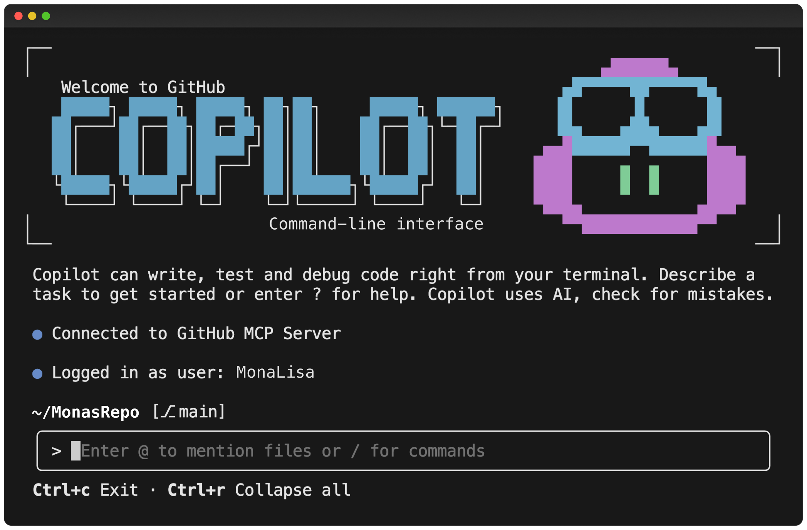

# GitHub Copilot Advanced: Spec-Driven Development and beyond

*Version 0.5 — June 2026*

Welcome! This workshop has two parts:

1. **Getting Started with GitHub Copilot**: a single broad chapter for anyone who has never (or barely) used GitHub Copilot. It covers inline completions, Chat, Agent mode, the Copilot CLI, custom instructions, prompt files, tools and MCP servers.
2. **Spec-Driven Development (SDD)**: the main part. You will learn how to make specifications, drive what GitHub Copilot builds for you, and you will do it end-to-end on a small TypeScript/Node feature.

The third (optional) chapter introduces [Spec Kit](https://github.com/github/spec-kit) as a tool to use spec driven development conveniently with most agentic coding tools.

<div class="info" data-title="Who is this for?">

> Developers, tech leads and architects who want bring their GitHub Copilot usage under control also for more complex scenarios. No prior Copilot experience is required, but recommended. Chapter 1 is designed to help you catch up fast.

</div>

<div class="warning" data-title="Heads up">

> GitHub Copilot evolves quickly. UI labels, menu locations and feature names may shift between releases. If something looks slightly different in your VS Code, search the Command Palette (`Cmd/Ctrl+Shift+P`) — the feature is almost certainly still there.

</div>

---

## Pre-requisites

You need the following before starting:

|                                 |                                                                                |
| ------------------------------- | ------------------------------------------------------------------------------ |
| A GitHub account                | [Create free GitHub account](https://github.com/join)                          |
| GitHub Copilot access           | Free, Pro, Business or Enterprise — see below                                  |
| Visual Studio Code              | [Download](https://code.visualstudio.com/)                                     |
| GitHub Copilot extension(s)     | [GitHub Copilot](https://marketplace.visualstudio.com/items?itemName=GitHub.copilot) and [Copilot Chat](https://marketplace.visualstudio.com/items?itemName=GitHub.copilot-chat) |
| Node.js 20+ and npm             | [Install](https://nodejs.org)                                                  |
| GitHub CLI                      | [Install](https://cli.github.com/)                                             |
| Copilot CLI                     | Installed via `gh extension install github/gh-copilot` (see Chapter 1.2)       |
| A terminal                      | Any modern shell (bash, zsh, pwsh)                                             |

### Getting Copilot access

- **Individual Free/Pro:** sign up at [github.com/github-copilot/signup](https://github.com/github-copilot/signup).
- **Through your organization:** request access at [github.com/settings/copilot](https://github.com/settings/copilot).

<div class="info" data-title="Enterprise note">

> Some features in this workshop (Agent mode, MCP, the GitHub Copilot CLI, spec-kit) may be restricted by your organization's policy. The workshop is structured so that each section is **independently useful**; skip what you cannot use.

</div>

---

# Chapter 1 — Getting Started with GitHub Copilot

> If you have never (or only barely) used GitHub Copilot, **start here**. This chapter is intentionally broad. Skip (parts of) it if you are already familiar and comfortable.

## 1.1 Copilot in VS Code

Open any folder in VS Code with the Copilot extensions installed. You will use four surfaces:

### Inline completions

Start typing and Copilot suggests grey inline completions. Accept with `Tab`, dismiss with `Esc`, cycle alternatives with `Alt + ]` / `Alt + [`. On Mac `Option + ]` / `Option + [`. 

> Tip: Check your configured shortcuts under `Ctrl + Shift + P` or `Cmd + Shift + P` -> `Open Keyboard Shortcuts`.

**Try it.** Create `hello.ts` and type:

```ts
// returns the nth Fibonacci number
function fib(n: number): number {
```

Let Copilot complete the body. Now add a second comment `// returns the nth prime` above a new function and watch how *prior context in the file* guiding the suggestion.

### Inline chat (`Cmd/Ctrl + I`)

Select code, press `Cmd/Ctrl + I`, and ask for a transformation: *"add input validation and JSDoc"*, *"convert to async/await"*, *"write a unit test for this"*.

### Chat view (`Cmd/Ctrl+Alt+I`)

The Chat side panel in "Ask" mode is for conversation about your code. Use `#` to attach context (files, symbols, selection) and `/` for built-in commands (`/explain`, `/fix`, `/tests`, `/new`).

```text
#file:src/auth.ts /explain why does login() throw on empty passwords?
```

### Agent mode

In the Chat view, switch the mode picker from **Ask** to **Agent**. Agent mode can read, create and edit files across your workspace, run commands (with your approval) and iterate until a task is done. This is the surface you will lean on most in Chapter 2.

<div class="tip" data-title="Pick the right mode">

> - **Ask** — questions, explanations, information gathering
> - **Agent** — autonomous task execution, coding, execution

</div>

## 1.2 GitHub Copilot CLI


GitHub Copilot is also IDE independent available via the CLI. It gives you an agent setup in your terminal.

Homebrew:

```bash
brew install copilot-cli
```

WinGet:

```bash
winget install GitHub.Copilot
```

npm:

```bash
npm install -g @github/copilot
```


Install the CLI extension for `gh`:

```bash
gh extension install github/gh-copilot
```

**Try it.** Open a terminal, navigate to any folder or repo, run `copilot --banner` and ask "what is this repository about?"

Especially when you run command line tools, always review the execution before accepting it. **Never blindly execute** suggested shell commands (in general).

## 1.3 copilot-instructions & AGENTS.md

GitHub Copilot reads project-level instructions from `.github/copilot-instructions.md`. There is always only one `copilot-instructions.md` per repository and it needs to be located exactly at `.github/`. You can create more specific instructions in `.github/instructions/*.instructions.md` (e.g. a `documentation.instructions.md`). GHCP also interacts with `AGENTS.md` files. You can have multiple of these in your repo. Always the "closest" `AGENTS.md` file is considered, so you can have multiple `AGENTS.md` files (e.g. `frontend/AGENTS.md`, `backend/AGENTS.md`). The files always needs to be specifically named `AGENTS.md`.

What should be considered for all instructions or `AGENTS.md` is 
1) that what the information provided by them should be relevant to be considered by the agentic AI in every context (because this is what will be happening) and 
2) to write them verifiable. Try to avoid vague statements like *"write good code"* or *"follow best practices"*. Instead try to stick with rules that can be potentially verified by a continuous integration job, like tests should be executable by `pytest` and concrete paths to files and folders the agent should consider or not touch.

This repo ships with one [`.github/copilot-instructions.md`](https://github.com/jkordick/ghcp-advanced/blob/main/.github/copilot-instructions.md). Feel free to open and read it. Notice it is short, declarative and project-scoped.

--- read until here

## 1.4 Prompt files

Prompt files (`*.prompt.md`) are **reusable prompts** stored in your repo. They show up in Chat as runnable commands.

Create `.github/prompts/new-feature.prompt.md`:

```markdown
---
mode: agent
description: Scaffold a new feature using our spec-driven workflow
---
You are helping me add a new feature.

1. Ask me clarifying questions until you have an unambiguous spec.
2. Write the spec to `specs/<feature>/spec.md`.
3. Propose a task list in `specs/<feature>/tasks.md`.
4. Wait for my approval before writing code.
```

Run it from Chat with `/new-feature`. Prompt files are the *primitive* you will build SDD on top of in Chapter 2.

## 1.5 Chatmodes

Chatmodes (`*.chatmode.md`) define a **persona + toolset + system prompt** that you switch into from the mode picker. Example: a `Spec Author` chatmode that disables code edits and forces the model to only ask questions and write markdown specs.

```markdown
---
description: Spec Author — only asks questions and writes specs, never edits code.
tools: ['codebase', 'search']
---
You are a senior product engineer acting as a spec author. Never write production
code. Your only outputs are clarifying questions and markdown files under `specs/`.
Stop after producing a spec and wait for explicit approval.
```

Save it as `.github/chatmodes/spec-author.chatmode.md` and pick it from the mode dropdown.

## 1.6 MCP servers

The [Model Context Protocol](https://modelcontextprotocol.io) lets Copilot connect to external tools — issue trackers, databases, browsers, your own services. Configure servers per workspace in `.vscode/mcp.json`:

```json
{
  "servers": {
    "github": {
      "type": "http",
      "url": "https://api.githubcopilot.com/mcp/"
    }
  }
}
```

Once connected, Agent mode can call those tools by name. For SDD, an MCP server pointing at your issue tracker is gold: Copilot can read the original ticket, write the spec, and link the PR back.

<div class="info" data-title="Enterprise"> 

> MCP servers may be governed by allow-lists. Check with your platform team before adding new ones.

</div>

## 1.7 Quick mental model

| Surface              | Use for                                          |
| -------------------- | ------------------------------------------------ |
| Inline completion    | Local, line-level help                           |
| Inline chat          | Targeted edits to a selection                    |
| Chat (Ask)           | Questions, explanations                          |
| Chat (Edit)          | Controlled multi-file edits                      |
| Chat (Agent)         | Autonomous tasks — the SDD workhorse             |
| Copilot CLI          | Same power, in the terminal / CI                 |
| Instructions         | Durable, project-wide rules                      |
| Prompt files         | Reusable, parameterizable workflows              |
| Chatmodes            | Personas + tool scoping for a class of tasks     |
| MCP servers          | Real-world tools and data the agent can use      |

You now have the full toolbox. The rest of the workshop is about **using it well**.

---

# Chapter 2 — Spec-Driven Development 

## 2.1 Why spec-driven?

A lot of people use agentic coding tools like this:

> *"build me a REST API for managing tasks"*

…and then spend the next hour wrestling with what the agent assumed. This is **vibe coding**: you ship intent, the agent ships interpretation, and the gap between them becomes technical debt and security risks.

**Spec-Driven Development (SDD)** tightly structures the agentic workflow:

Spec  →  Plan  →  Task  →  Implement

The spec describes the **what** in the form of user stories. The plan describes the technical **how**. The tasks are a todo list based on the spec and the plan. In the implementation, the task list is executed. 

You gain three things:

1. **Reviewability.** A precise spec & plan is something a human (or a second AI agent) can review. 800 lines of generated code distributed between multiple files is not.
2. **Control.** The 3-steps of planning create a "contract" between your intent and the executing by an agentic AI. 
3. **A structured way of working & better outcomes.** With the help of divide and conquer, you can get to more complex, multi-file, multi-iteration features that are still managable and maintainable.

<div class="tip" data-title="Important">

> If you struggle break down the task at hand into a reasonable sized spec, you probably need to break the task at hand into smaller pieces. SDD is not a silver bullet for complexity — it is a discipline that helps you manage it, but it does not replace good judgment in scope definition.

</div>

## 2.2 Hands-on: build The Rubber Duck Emporium with SDD

You will build a small e-commerce applicatiom for **The Rubber Duck Emporium** — a shop that sells specialty rubber ducks for every possible occasion: Debugging Ducks, Philosopher Ducks, Maritime Ducks, Wellness Ducks, and Limited Editions.

The user stories live in the [`user-stories/`](https://github.com/jkordick/ghcp-advanced/tree/main/user-stories) folder of this repo. **Read [`user-stories/README.md`](https://github.com/jkordick/ghcp-advanced/blob/main/user-stories/README.md) first** — it describes the product, personas (Quincy Quacker the customer, Dr. Mallard the curator), shared constraints, and the dependency graph between stories.

There are 9 stories. A realistic ~90-120 minute run completes the full application.

### 2.2.1 Scaffold

```bash
mkdir duck-emporium && cd duck-emporium
npm init -y
npm i -D typescript tsx vitest @types/node
npx tsc --init
mkdir -p src specs
git init && git add -A && git commit -m "scaffold + user stories"
```

Add a minimal `AGENTS.md` in the `duck-emporium/` folder:

```markdown
# Project: duck-emporium
- Language: TypeScript (ES modules), Node 20+.
- Use `node:`-prefixed built-ins.
- Tests live next to source as `*.test.ts`, run with `vitest`.
- User stories live in `../user-stories/`. Specs go in `specs/<story-id>/`.
- Never edit `user-stories/**` or `specs/**` without explicit instruction.
- Follow the workflow in `.github/prompts/sdd-*.prompt.md`.
- Payments are MOCKED. Never integrate a real payment provider.
```

### 2.2.2 Add the SDD prompt files

Create `.github/prompts/sdd-spec.prompt.md`:

```markdown
---
mode: agent
description: Turn a user story into a reviewable spec.
---
Goal: produce `duck-emporium/specs/{story-id}/spec.md` from `user-stories/{story-id}.md`.

Rules:
- Read the user story file first. Treat it as raw input, not as a spec.
- Ask clarifying questions ONE at a time. Use the "Open questions" section of the user story as a starting point but go beyond it.
- Do not write code or any file other than `duck-emporium/specs/{story-id}/spec.md`.
- When you have enough information, write the spec using this outline:
  Problem, Users, Scope (in/out), Functional requirements,
  Non-functional requirements, Acceptance criteria, Open questions.
- Stop after writing the spec and wait for approval.
```

Create `.github/prompts/sdd-plan.prompt.md`, `sdd-tasks.prompt.md` and `sdd-implement.prompt.md` following the same pattern — one step each, no shortcuts. Each prompt should read the previous artifact and produce exactly one new one.

### 2.2.3 Run the loop, story by story

Pick story 1 (`browse-catalog`). In Chat (Agent mode):

```text
/sdd-spec story: browse-catalog
```

Answer the clarifying questions. Expect to make a foundational decision here that will affect every later story — e.g., *"is this a JSON API or a server-rendered web app?"*, *"what fields does a `Duck` have?"*. Review `duck-emporium/specs/browse-catalog/spec.md`. Iterate until you are happy.

Then:

```text
/sdd-plan story: browse-catalog
/sdd-tasks story: browse-catalog
/sdd-implement story: browse-catalog task 1
/sdd-implement story: browse-catalog task 2
```

…and so on. **Commit after every passing task.** When the story is done, move on to story 2 (`duck-detail`), which builds on story 1's foundation.

<div class="tip" data-title="Tip">

> Of course spec driven development can potentially take all user stories at once, but we recommend doing it one by one for the first few times until you get the hang of it. If you want to experience the all-in-one-go experience, check out the spec-kit chapter in this workshop.

</div>

### 2.2.4 What you should notice

- During story 1's spec, you make decisions (Duck shape, storage, transport) that *prevent* whole categories of confusion in stories 2-8.
- The agent stops asking *"what did you mean by…?"* mid-implementation — because you front-loaded that in the spec.
- When a test fails, the fix is local to one task, not a sprawling rewrite.
- If you change your mind, you edit the spec and re-run from `/sdd-plan`. The plan, tasks and code regenerate cleanly.
- A teammate can review `spec.md` + `tasks.md` in 5 minutes and know exactly what shipped.
- The user story files are *never* edited by the agent — they are the immutable source of truth for "what the customer asked for".

<div class="tip" data-title="Do this now">

> Even outside the workshop, try this on the next ticket in your real backlog: copy the ticket text into a `user-stories/` file, then run `/sdd-spec` against it. Time-box to 20 minutes. The clarity gain is the win — code is a bonus.

</div>

## 2.3 SDD in the Copilot CLI

Everything above works in the GitHub Copilot CLI too. Same prompt files, same instructions — just invoked from `copilot` in your terminal.

---

# Chapter 3 (optional) — Spec Kit by GitHub

[Spec Kit](https://github.com/github/spec-kit) is an open-source toolkit by the GitHub team formalizes and extends the loop you just did by hand. As it is an open-source project it can not only be used in combination with GitHub Copilot but [many more agentic AIs for coding](https://github.github.io/spec-kit/reference/integrations.html). So if you now want to give it a try with Claude, Cursor or Codex, this is the moment.

It ships a `specify` CLI that scaffolds the `specs/` layout, prompt files and chatmodes for you, and integrates with several AI agents.

<div class="warning" data-title="Enterprise organization check">

> Some organizations restrict which CLIs developers can install (`uv`, `uvx`, `npx`, etc.). If `specify` is not allowed in your environment, you have already learned the underlying workflow in Chapter 2.

</div>

## 3.1 Install & initialize the project

Follow in installation instructions in the [spec-kit README.md](https://github.com/github/spec-kit#-get-started). 

In the root of the project:

```bash
specify init duck-emporium --integration copilot
## choose between bash or powershell
cd duck-emporium
```

<div class="warning" data-title="Workaround">

> When you open the duck-emporium folder you will notice that it created multiple folders. Cut and copy them to the root of the project. To make them easy accesible for the agent.

</div>


This creates a structured layout with the SDD phases (`/speckit.specify`, `/speckit.plan`, `/speckit.tasks`, `/speckit.implement` and some additional steps) pre-wired as slash commands.

## 3.3 Run the same loop, but guided

In GitHub Copilot Chat:

```text
/speckit.specify checkout #user-stories and create a specification out of them
```

<div class="tip" data-title="Branching">

> When spec-kit starts working it creates a dedicated working branch.

</div>

Compare what spec-kit works and what it generates against the hand-rolled prompts from Chapter 2. You will recognize every step — spec-kit just removes the boilerplate.

# Wrap-up

You (hopefully) have learned:

- The full surface area of GitHub Copilot: IDE, CLI, instructions, prompts, custom agents, MCP.
- A repeatable, reviewable, agent-friendly development loop: **Spec → Plan → Tasks → Implement.**
- How to apply that loop with a raw agent, and (optionally) with spec-kit as a dedicated tool.

## Where to go next

- [GitHub Copilot docs](https://docs.github.com/en/copilot)
- [Awesome Copilot](https://github.com/github/awesome-copilot) — community prompts, chatmodes, instructions
- [spec-kit](https://github.com/github/spec-kit)
- [Model Context Protocol](https://modelcontextprotocol.io)
- The original [GH Copilot HoL](https://moaw.dev/workshop/gh:Philess/GHCopilotHoL/main/docs/) — broader foundational GitHub Copilot product tour this workshop builds on
- [squad](https://github.com/bradygaster/squad) - human-directed AI development team through GitHub Copilot

<div class="tip" data-title="One thing to try tomorrow">

> Pick the next ticket in your backlog. Before writing a line of code, open Agent mode and run a `/sdd-spec` style prompt. Time-box it to 20 minutes. Notice how much sharper your understanding of the work becomes — that is the real win of SDD.

</div>

Happy spec-driving! 🚀
